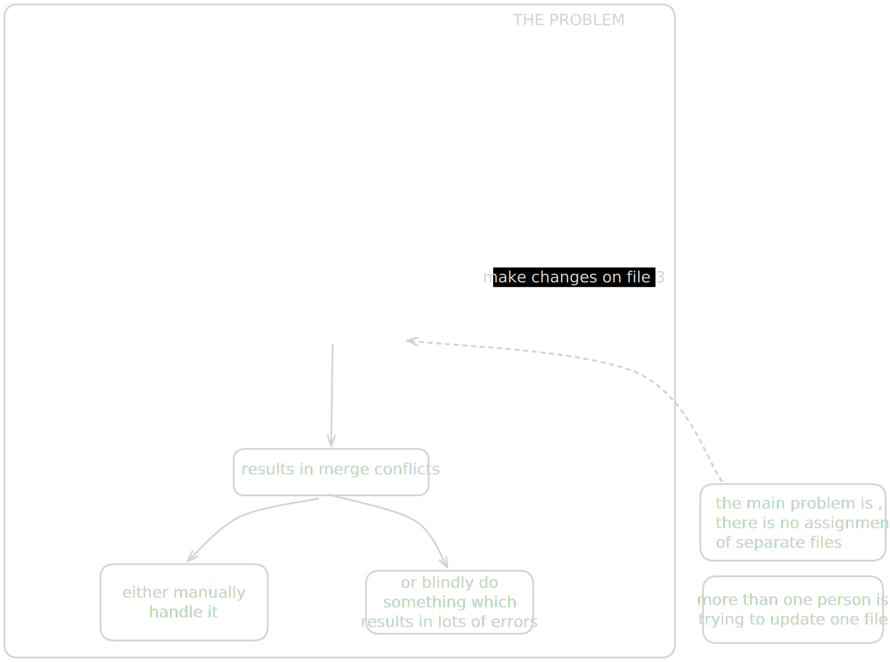
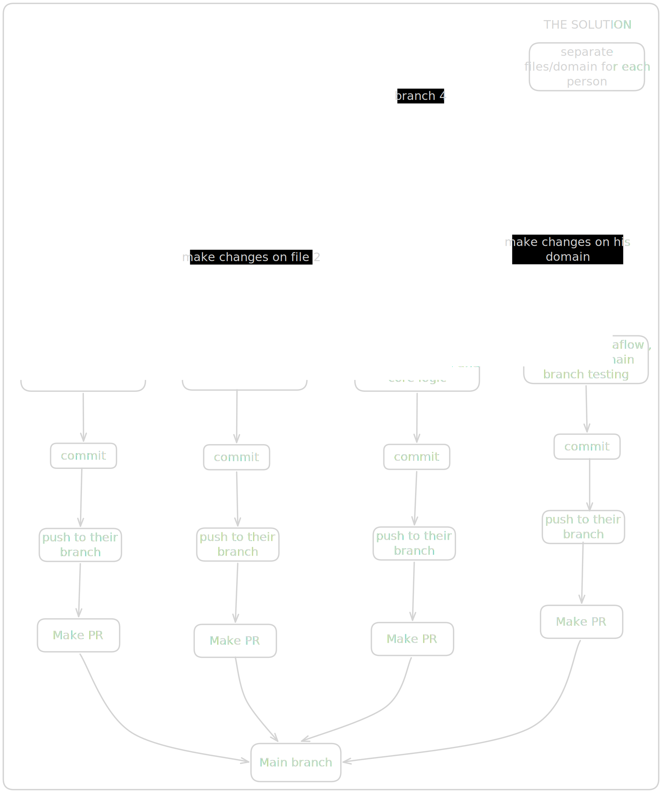
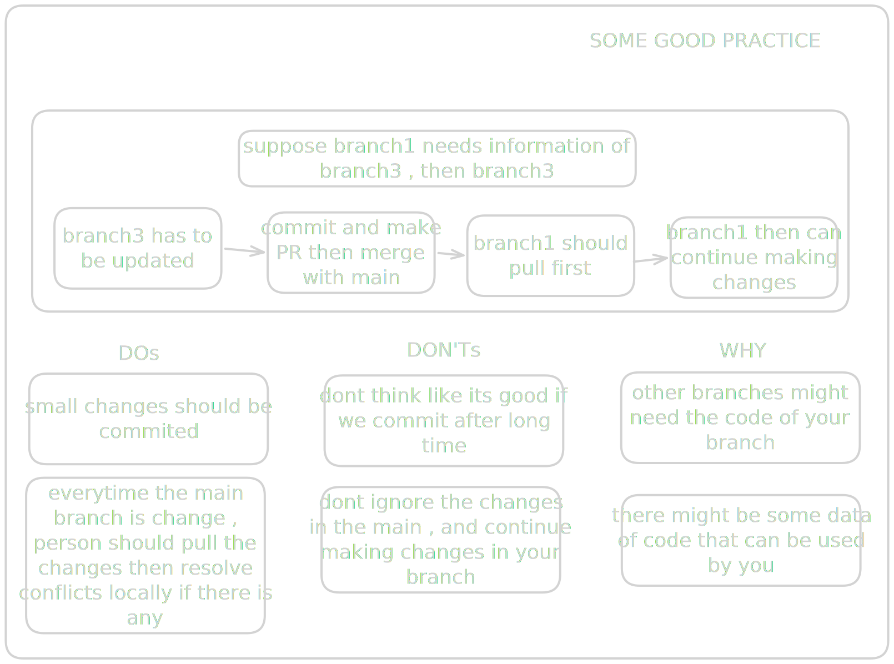
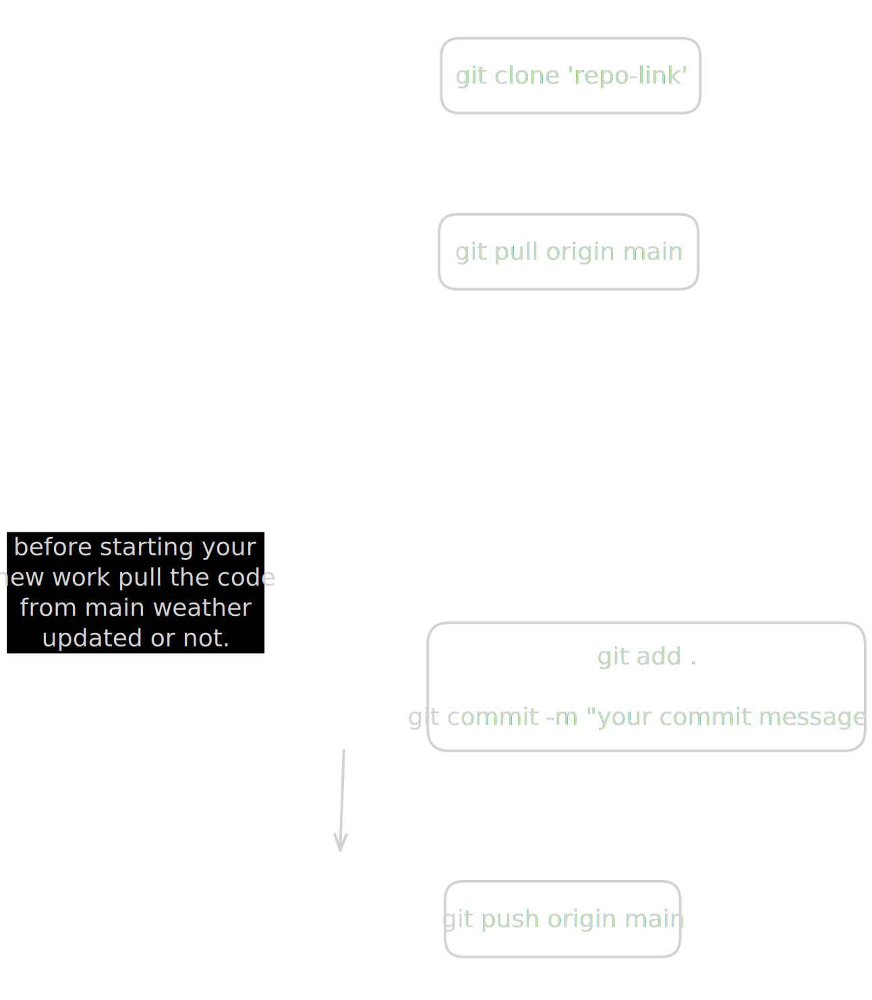

# Understanding-Github
this is me , trying to clear my doubts.

# What was the problem my team faced in the last few hackathons...

we were getting merge conflicts ...

# So this is the solution ...

This good only for hackathons or small projects , and not a best practice for large projects...

so there is only one main branch , no need of making multiple branches , (can be made for safety reasons) , but for now  , a better solution would be to assign different file / folder to the teammates..

like 

/teammate-1/**
/teammate-2/**
/teammate-3/**

and one person ( the repo creator  / leader )
will handle the files getting pushed on the main branch 

so dear teammates , please do - 

`git pull origin main `

before starting your new work

and I REPEAT , no need of making new branch , work on main branch we'll see if something crashes.
or 
Branches are optional for now.
If you are working on a risky feature, create a branch.
Otherwise small direct pushes to main are okay.

your flow should be ..

